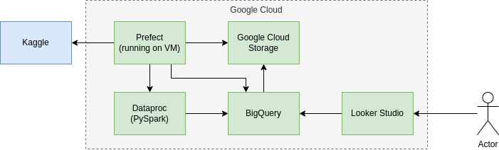
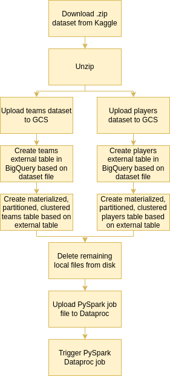
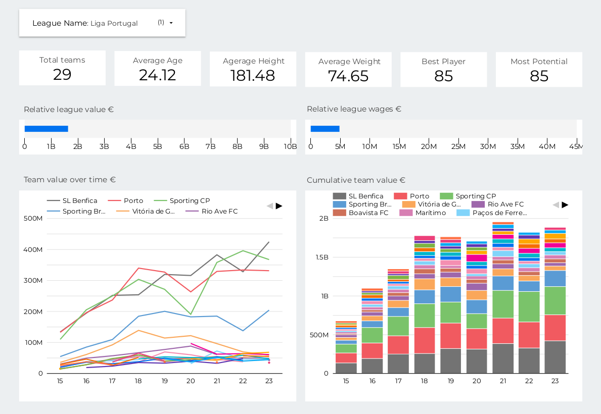

# FIFA 23 data pipeline  

The aim of this project is to create a data pipeline that takes the 
[Kaggle dataset of players and teams from the game FIFA 23](https://www.kaggle.com/datasets/stefanoleone992/fifa-23-complete-player-dataset) 
and produces a visualization of the evolution of team's value over time (based on their individual players).
This information is incomplete in the dataset, so it can be a nice demonstration of the use of data engineering tools.

This project was made for the [DataTalksClub data engineering zoomcamp](https://github.com/DataTalksClub/data-engineering-zoomcamp).

## ToC

1. [Tools](#tools)
2. [Architecture](#architecture)
3. [Dashboard](#dashboard)
4. [Setup](#setup)

## Tools

The tools used in this project were:

- **Google Cloud**: Where the whole project operated
- **Terraform**: To programmatically instantiate different cloud components
- **Google Cloud Storage (GCS)**: To store different types of data
- **BigQuery**: To store, transform and analyse large amounts of data
- **Prefect**: To orchestrate the ETL operations
- **Spark + Dataproc**: To transform data 
- **Looker Studio**: To visualise data kept in BigQuery

## Architecture

The project was made to run on Google Cloud and uses tools provided by it.
Prefect orchestrates various ETL operations (more details later). 
These operations interact with the local system, GCS, BigQuery and Spark + Dataproc.
In the end, Looker Studio is used to create the dashboard, based on data present in BigQuery.

### Prefect 

Prefect has various ETL operations:

- Download the dataset from Kaggle and store it locally.
- Unzip the file
- Upload the male players and male teams csv files to GCS
  - I wanted to first convert the files to .parquet, but since the players file had 5Gb+ size, the VM run out of memory. Thus, I uploaded the .csv file directly
- Create external tables based on those files
- Create partitioned, clustered, materialized tables based on the external tables
- Delete local files that are no longer needed
- Upload python file containing spark logic to the dataproc cluster
- Trigger the spark job in dataproc which will:
  - Query what are the last update for each FIFA version
    - i.e. The FIFA dataset contains all the data for each update of each version of the game. So, for example, for FIFA 22, there can be 60 updates to the game, and the dataset tracks all the players and teams for each update. A decision was made to only keep the last update for the visualizations
  - Select the teams and players for the last update of each FIFA version 
  - Join the players with the teams 
  - Calculate metrics for teams for each version of the game
    - e.g. the total value of the team based on the sum of the values of the players of the team

## Dashboard

In the end of the Prefect pipeline, we will have in BigQuery a table that contains, for each FIFA version, the teams in their leagues, plus various metrics for those teams. 
We can use Looker to create visualizations based on this table. You can se it in the image below.

In the dashboard, you can select the league you want to see. From there, you have several metrics about the league, 
as well as some graphs showing the evolution of the league's teams' value.

## Setup 

The project was setup to run on Google Cloud, so you will need to register an account there. 

### VM 

To setup the virtual machine where we will run Terraform and Prefect:

- Follow instructions [in this video](https://www.youtube.com/watch?v=ae-CV2KfoN0&list=PL3MmuxUbc_hJed7dXYoJw8DoCuVHhGEQb&index=12) to create VM: 
  - IAM necessary permitions:
    - BigQuery Admin
    - Storage Admin
    - Storage Object Admin
    - Viewer
    - Dataproc Admin
  - In the access scopes, make sure to allow access to the Cloud APIs
    - This is to allow requests to Dataproc, so you might just need to allow that one
- Configure Terraform as per the same video
  - To do this, you also need to create Google Cloud Service Account, as explained [in this video](https://www.youtube.com/watch?v=Hajwnmj0xfQ&list=PL3MmuxUbc_hJed7dXYoJw8DoCuVHhGEQb&index=12): 
  - Grant the necessary access (IAM menu) to that account
- Clone repo from: TODO
- The machine should already have python installed, but you need to install pip `apt install python3-pip`
- Creat an env file (I called it `my.env`) based on example.env, edit the values, and export my.env file variables `export $(grep -v '^#' my.env | xargs)`
  
### Terraform 

We will use terraform to create our cloud storage and BigQuery services.

- Run: `terraform init` -> `terraform plan` -> `terraform apply` 

### Prefect

- Install requirements `pip install -r requirements.txt`
  - Note: not using virtual environment since the machine will only run prefect
  - Note: Had problems installing kaggle library, had to do what [user13451415](https://stackoverflow.com/users/13451415/user13451415) advices in the comments of [this SO answer](https://stackoverflow.com/a/73932621/4792673)
  - Note: Some prefect tasks require `gcloud` CLI. It comes preinstalled in Google Cloud VMs, but if you're not using it, you have to install and configure it first.
- Set your Kaggle user and key in the my.env file (you have to register a user in Kaggle and generate a key)
  - Export again if needed
- Start Prefect Orion on a terminal window: `prefect orion start`
- In order to make the prefect GCP block, in the `prefect/blocks/make_gcp_block.py` file, insert the contents of your service account .json file. Then run the file: `python3 prefect/blocks/make_gcp_block.py`
- In order to run everything, you just need to run `python3 etl_kaggle_to_big_query.py`. But you can also setup a deployment to run every  month, running the following commands:
  - `prefect agent start --work-queue "default"` in a seperate terminal to get an agent to pick up the job
  - `prefect deployment build prefect/flows/etl_kaggle_to_big_query.py:fifa_flow -n fifa_flow --cron "0 0 1 * *"` to schedule the job to run at the start of every month
  
